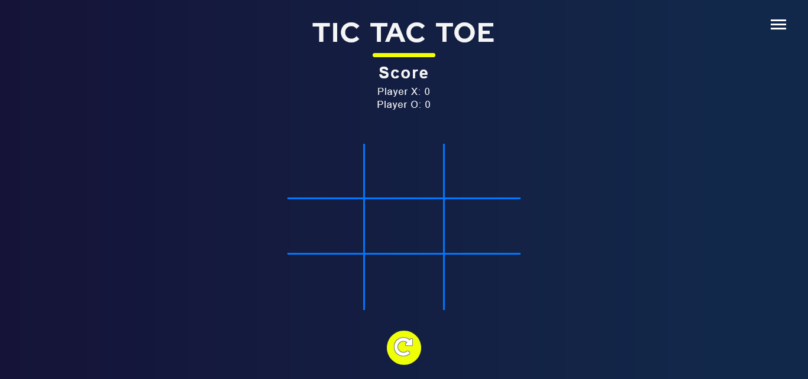
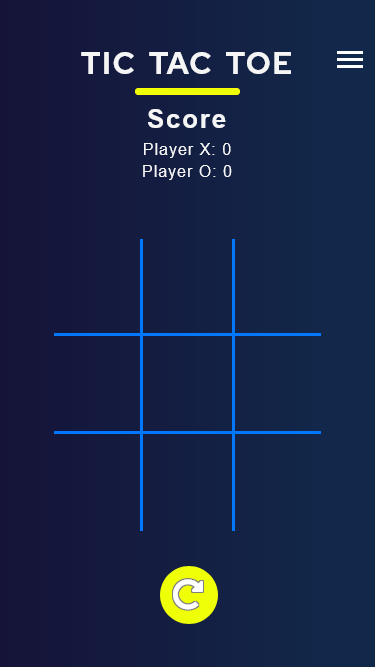

# Ticky Tacky - Design Preview



This repo provides my implementation of the classic tic tac toe game. Tic-tac-toe, noughts and crosses, or Xs and Os is a paper-and-pencil game for two players who take turns marking the spaces in a three-by-three grid with X or O. The player who succeeds in placing three of their marks in a horizontal, vertical, or diagonal row is the winner. 

## Table of contents

- [Overview](#overview)
  - [The challenge](#the-challenge)
  - [Screenshot on mobile](#screenshot-on-mobile)
  - [Links](#links)
- [My process](#my-process)
  - [Built with](#built-with)
  - [What I learnt](#what-i-learnt)
  - [Continued development](#continued-development)
  - [Useful resources](#useful-resources)
- [Author](#author)
- [Acknowledgments](#acknowledgments)

## Overview

### The challenge

Users should be able to:

- Interact with a three by three grid, in such a way that conforms to the rules of the tic tac toe game.
- Keep track of game scores, even after shutting down the browser.
- **Bonus**: Introduce interactive media elements to make the game more engaging

### Screenshot on Mobile



### Links

- Solution URL: [Github](https://github.com/Minard-NG/Tic-Tac/blob/main/index.html)
- Live Site URL: [Hosted with Netlify](https://tickytacky.netlify.app/)

## My process

### Built with

- Semantic HTML5 markup
- CSS3
- JavaScript
- Flexbox
- Mobile-first workflow
- Git and GitHub

### What I learnt

The high level markup for this project is fairly simple.  

```html
<html>
  <head>
  </head>
  <body>
    <div id='overlay'>
      <div id="confirm_modal">
        Used to create the web structure for the custom game onboarding modal
      </div>
    </div>
    <header>Contains the page's header information</header>
    <main>All the awesome game buttons went in here</main>
    <footer>Contains the reset button</footer>
  </body>
</html>
```

Using google fonts to add custom fonts for my web projects has been a defacto for me. So I had tried accessing the google fonts website to add custom fonts while developing this project, but all the time I tried, the site would not open on my device. Still researching what the issue is, but in the mean time, I decided to implement the custom 'Red Hat' font, used for this project by dowloading it from font squirrel and using the @font-face selector. It provided a good work around but I noticed some lag whenever the page loads when I deployed it.

#### Code snippet for custom font:

```css
@font-face {
  font-family: "Red Hat";
  src: url("/font/red-hat/RedHatDisplay-Bold.otf") format("opentype");
  font-weight: 700;
  font-style: normal;
}
```

For the game logic, I implemented a pretty naive brute-force algorithm, were I fetch all the game buttons and continuously check if a winning position has been attained whenever a player makes a valid click. This algorithm helped checked for win and lose cases but for a deuce case, things get a little different. I check for a condition where no player has won the game and all the space on the 3 x 3 grid is filled. The commentary in the header is also updated dynamically as the game is played.

#### Code snippet for win case:

```js
function checkWin() {
    const btn1 = document.getElementById('btn1').innerText;
    const btn2 = document.getElementById('btn2').innerText;
    const btn3 = document.getElementById('btn3').innerText;
  //and so on

    //check for win state 1,2,3
    if ((btn1 === 'X' && btn2 === 'X' && btn3 === 'X') || (btn1 === 'O' && btn2 === 'O' && btn3 === 'O')) {
        return true;
    }
//and so on
}
```

#### Code snippet for deuce case:

```js
function play(){ //event handler binded to the game buttons

    //start with a deuce status of true
    let deuceStatus = true;

    //check for if a win condition was met
    winStatus = checkWin()

    //check if the 3 x 3 grid is filled
        btnList.forEach(function (btn) {
            if (btn.innerText === '') {
                deuceStatus = false;
            }
        });

    //if 3 x 3 grid is filled and no player has won then perform the action for a deuce
        if (deuceStatus && !winStatus) {
            commentary.innerText = `No lucky champ! It's a Deuce!`;
            deuce_sound.play();
            setTimeout(function () {
                currentPlayer = 'X';
                btnList.forEach(function (btn) {
                    btn.innerText = '';
                })
            }, 600)
        }


}
```

Developing the interactive harmburger presented an interesting opportunity to do some CSS3 animation which is something I trying to learn more about and also do some DOM manipulation. The key concept was to style three spans to have the harmburger-button shape and on click the first and third span rotates a certain amount of degrees to form a cross while the second span loses visibility. Here is my approach: 

### Code Snippet showing the html structure for the harmburger-button
```html
  <div id="ctBtn" class="controls">
      <div id="hmBtn" class="harmburger--show">
          <span></span><span></span><span></span>
      </div>
      <i class="fas fa-volume-up" title="click to mute background music"></i>
  </div>
```

### Code Snippet Showing the CSS Styles

```css
.controls {
  position: absolute;
  right: 0px;
  top: 1.15rem;
  width: 1.775rem;
  height: 1.4375rem;
  font-size: 1.875rem;
   overflow-y: hidden;
  
}
.controls:hover{
    cursor: pointer;
}
.ct--animate{
    animation: ctanime 200ms linear forwards;
}
.controls .fas{
    padding-top: 1.25rem;
    font-size: 1.4rem;
}
@keyframes ctanime{
    from{
        height: 1.875rem;
    }
    to{
        height: 4.6875rem;      
    }
}
.harmburger--show span,
.harmburger--toggle span {
  display: block;
  width: 1.625rem;
  height: 0.125rem;
  border-bottom: 0.1875rem solid white;
}
.harmburger--show span:not(:last-child) {
  margin-bottom: 0.25rem;
}
.harmburger--show span:nth-child(1) {
  animation: fade-out-1 200ms ease-in-out forwards;
}
.harmburger--show span:nth-child(2) {
  animation: fade-out-2 200ms ease-in-out forwards;
}
.harmburger--show span:nth-child(3) {
  animation: fade-out-3 200ms ease-in-out forwards;
}
.harmburger--toggle span:nth-child(1) {
  animation: fade-in-1 200ms ease-in-out forwards;
}
.harmburger--toggle span:nth-child(2) {
  animation: fade-in-2 200ms ease-in-out forwards;
}
.harmburger--toggle span:nth-child(3) {
  animation: fade-in-3 200ms ease-in-out forwards;
}
@keyframes fade-out-1 {
  from {
    margin-top:11px;
    transform: rotate(45deg);
    transform-origin: 40% 0%;
  }
  to {
    margin-top: 0;
    transform: rotate(0deg);
    transform-origin: center;
  }
}

@keyframes fade-out-2 {
    from {
        opacity: 0;
        visibility: hidden;
    }
    to {
        opacity: 1;
        visibility: visible;
    }
  }

@keyframes fade-out-3 {
  from {
    transform: rotate(-45deg);
    transform-origin: 18% 70%;
  }
  to {
    transform: rotate(0deg);
    transform-origin: center;
  }
}

@keyframes fade-in-1 {
  to {
    margin-top:11px;
    transform: rotate(45deg);
    transform-origin: 40% 0%;
  }
}

@keyframes fade-in-2 {
  to {
    opacity: 0;
    visibility: hidden;
  }
}

@keyframes fade-in-3 {
  to {
    transform: rotate(-45deg);
    transform-origin: 18% 70%;
  }
}
```

### Code Snippet for the JS that toggles the classList appropriately.

```js
let hmBtn = document.querySelector('#hmBtn');
let ctBtn = document.getElementById('ctBtn')

hmBtn.addEventListener('click', function(){
    notif_sound.play()
    if(hmBtn.classList.contains('harmburger--toggle')){
        hmBtn.classList.add('harmburger--show')
        hmBtn.classList.remove('harmburger--toggle')
        ctBtn.classList.remove('ct--animate')
       
    }else{
        hmBtn.classList.remove('harmburger--show')
        hmBtn.classList.add('harmburger--toggle')
        ctBtn.classList.add('ct--animate')
        
    }
});
```


One key concept I experimented while developing this project was the mobile first approach, where I build for smaller devices and implement media queries to enhance the layout/features as for larger devices. I found it very helpful.


### Continued development

Would continue to learn more about CSS3 grid and improve my knowledge of algorithms. 

### Useful resources

- [Countdown Timer](https://www.sitepoint.com/build-javascript-countdown-timer-no-dependencies/) - This is an amazing aritcle which helped me understand the JS date and time function, I love their functional programming style too.
- [Negative Border Radius in CSS?](https://stackoverflow.com/questions/45339986/negative-border-radius-in-css/45340988) - This stackoverflow question and answer was useful in helping me figure out the implementation of the curve around the cards.
- [Mozilla Docs | @font-face](https://developer.mozilla.org/en-US/docs/Web/CSS/@font-face) - Amazing documentation on MDN web docs to get you started adding custon fonts on your web pages.
- [How to change the color of an svg element?](https://stackoverflow.com/questions/22252472/how-to-change-the-color-of-an-svg-element) - Helped me figure out how to change the color of svg on hover state.
- [A useful CSS filter generator](https://codepen.io/sosuke/pen/Pjoqqp) - A cool filter generator program on codepen.io

## Author

- Frontend Mentor - [@Minard-NG](https://www.frontendmentor.io/profile/Minard-NG)
- LinkedIn - [Michael Nwankwo](https://www.linkedin.com/in/michael-nwankwo/)

## Acknowledgments

I would really love to appreciate and make a special shout to Jessica Chan, owner of the blog [coder-coder.com](https://coder-coder.com/) and youtube channel [Coder Coder](https://www.youtube.com/c/TheCoderCoder). Her useful contents, got me trying out this challenge on frontend mentors. I also really appreciate the amazing team behind frontend mentors, I'd totally recommend their platform to anyone trying to build capacity in frontend programming.
